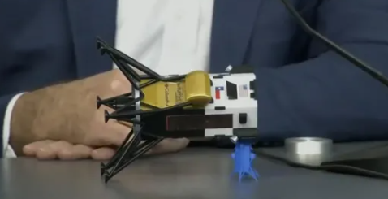
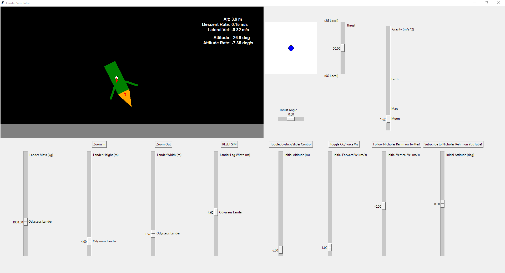

# LanderSim

This is a physics-based simulation of a thrust vectored lunar lander with tons of sliders and options to play around with. 

To run, clone this repo and run: `python landerSim.py`

Or if you are scared of running python but not scared of random .EXEs on the internet, there is an executable located in the releases tab of this page that will launch the application with no python-fuss required (Windows only, sorry).

    

## What & Why?

Inspired by recent, rather tippy lunar landers, you can play around with diferent lander geometry, gravity, mass, inertia, etc. in this simplified simulaton. Initial conditions for the sim can be set with sliders, and the lander can be steered either by a simple joystick, or individual sliders to directly control thrust and thrust vector direction.

    

The simulation is a simple 3DOF rigid-body dynamics sim while in flight. The sim is driven by real, live equations of motion and is not simply an animation that was tweaked to "feel" right. Once ground contact has been made, the sim assumes a no bounce/slip condition on the landing legs, and linear momentum at touchdown is converted into angular momentum. This inelastic collision assumption is a decent approximation for relatively low-speed touchdowns, but a pretty bad one for high speeds where the lander leg collision with the ground would realistically be more elastic (bouncy).

It is very counter-intuitive, but lower gravity leads to comparatively more "tippy" landers, since mass/momentum at a higher or lower gravity is the same, but the restoring force of gravity when tipping is lower. At touchdown, any linear momentum you have will basically be transferred into angular momentum, so you begin rotating, or tipping. With stronger gravity, the restoring force at touchdown to prevent tipping over is much stronger, wheras lower gravity has a harder time countering all that new angular momentum before it is past the point of no-return. If this hurts your brain, try turning on the CG/force visualization option and playing around with different gravities and touchdown velocities.

Have fun!

https://www.youtube.com/nicholasrehm